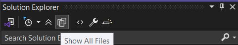
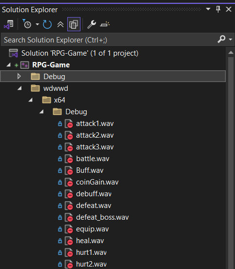
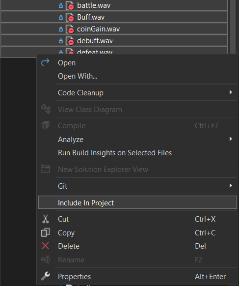

# CSC-145 - Text-Based Role-Playing Game (RPG)

## Project Description
We have no idea what we're doing.

## Setting Up Git and Syncing with Visual Studio
### Dowload Git for Windows

Git is our version control system and can be downloaded for Windows, Mac and Linux systems.
The guide here is specifically meant for Windows hosts; however, the website and guides online can show how to download for other hosts.

Once you've downloaded the latest version of Git, run the application, and the default prompts are acceptable for our purposes.
Feel free to customize to your personal preference (Hint: Vim sucks as a text editor). Many of these settings can be changed later.

[Download Here](https://git-scm.com/downloads)

### Configure Author Details

Once Git is installed you'll want to access the Git Bash terminal. The terminal uses typical bash commands and text editors.
Git identifies the author of commits using a username and email so at the prompt use the commands:
```bash
git config --global user.name "{username}"
git config --global user.email "{email_address}""
```
Verify status of these using:
```bash
git config --global --list
```
or
```bash
git config user.name
git config user.email
```

### Create a Local Repository
To create a local repository you'll need to have a project with Visual Studio.
Either create a new C++ empty project or use and existing one and navigate to where your code files are located.
```bash
cd C:/Users/.../Project/ProjectName/SolutionName/
```
Here you need to run the git initialize command.
```bash
git init
```
Now a new .git (hidden folder) will be placed in that directory and can be used as the source to pull and push changes.

To set up the connection to GitHub you need to add the website as a remote origin.
```bash
git remote add origin https://github.com/{username}/CSC145-TextBasedRPG.git
```
Don't forget the .git part.
If you make a mistake run
```bash
git remote remove origin
```
and try again.

Verify the changes with
```bash
git remote -v
```

### Pull from GitHub
BEFORE YOU PUSH ANY CHANGES YOU NEED TO PULL THE CURRENT FILES DOWN.

Use
```bash
git pull origin main
```

### Add and Commit Changes
DID YOU NOTICE THE CAPITALIZED TEXT BEFORE, PULL CHANGES BEFORE THIS!!!

Implement a new branch when you're working on new features.

To see all branches available in your repository use:
```bash
git branch
```
The asterisk shows you the current branch you're working in.

To switch branches use switch or checkout (switch is a newer method).
```bash
git switch branch-name
git checkout branch-name
```

After you've pulled changes, now push them by adding the files and committing the changes with a message.

Adding all files is done by:
```bash
git add .
git commit -m "Commit message details here."
```

Add specific files using:
```bash
git add filename.cpp
git commit -m "Commit message again."
```

FOR NEW BRANCHES USE THIS:
```bash
git push --set-upstream origin branch-name
```
It sets up the upstream branch with this version.

For changes to be sent to GitHub, push the changes.
```bash
git push origin current-branch-name
```

### Merge Changes
Merging changes with main can also be done with Git Bash.

First switch to main:
```bash
git switch main
git checkout main
```

And merge using git merge:
```bash
git merge feature-branch-name
```

Then push the merged changes.
```bash
git push origin main
```

Delete the feature branch with:
```bash
git branch -d  feature-branch-name # Local repos only.
git push origin --delete feature-branch-name
```

## Syncing Git Files with Visual Studio
Go to your Visual Project with the newly added files from Git.

Step 1 - Open Solution Explorer --> Show All Files

This lets you see all the files not included in the project



Step 2 - Open Up the Folders Needed

All files not in the project have the red minus symbol.



Step 3 - Right-clik and click "Include in Project"

Unhighlight the "Show All Files" (See Step 1) to view your newly added files.



## Contributors
*Ian McCurdy* - Project Mismanager, Watch Out For This One (Has a Tendency to Delete Main)

*Philomène Sturgeon* - Software De-engineer, Has an Accented è (Some French Thing)

*Noah Parkhurst* - Software Architect and Owner of a Monopoly of Food Establishments on FUS Grounds.

*Christian Wolk* - Professional Band Kid, Also Codes (We Think)